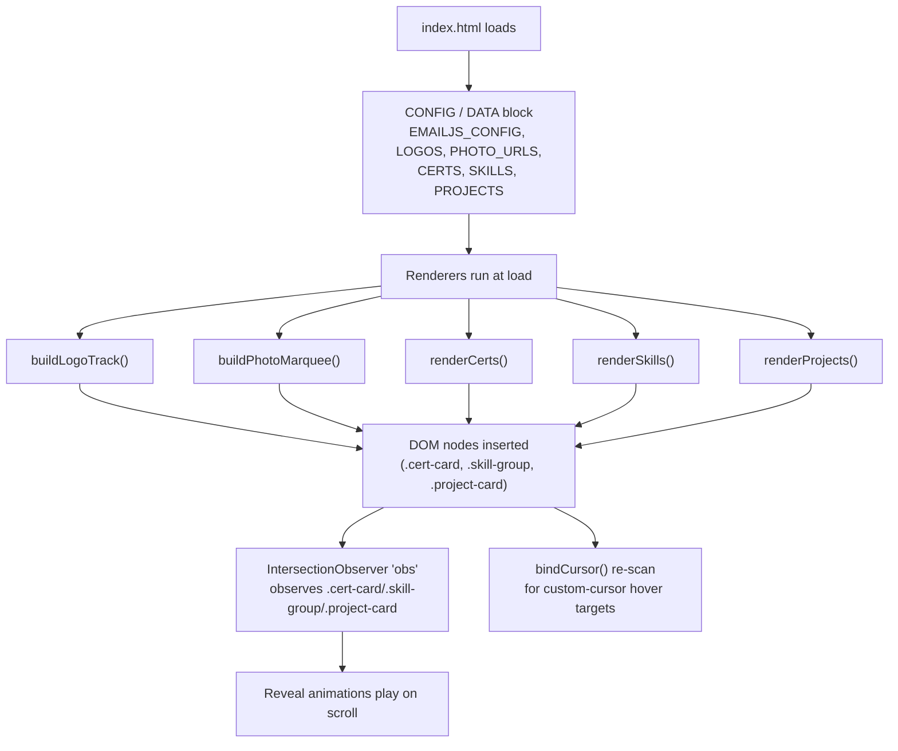

# Design Document

## Overview

This design enhances the existing single-page static portfolio (`index.html`, ~1770 lines) of Dharma Teja Sunkara. The whole site is one hand-authored HTML file with inline `<style>`, a static `<body>`, and one `<script>` block that already follows a lightweight "data + renderer" idiom for a couple of sections (the `LOGOS` array feeding `buildLogoTrack()`, and a `PHOTO_URLS` array feeding `buildPhotoMarquee()`).

The enhancement delivers four outcomes without changing that fundamental shape:

1. **Structural cleanup** — fix section numbering so labels read `01…NN` in document order, and remove duplicated/dead CSS (`.journey-*` block, redundant `body::before`, undefined `--orange`) while preserving the rendered appearance.
2. **Data-driven content** — introduce three editable collections (`CERTS`, `SKILLS`, `PROJECTS`) declared together in a clearly labeled `CONFIG / DATA` block near the top of the existing `<script>`, each consumed by a small renderer function that builds the section DOM at load. This mirrors the existing `LOGOS` pattern so future edits are one-line data changes.
3. **New content and link corrections** — add three agentic-AI projects (DocuMind, LoopDesk, RepoSage) rendered before the existing three, convert certifications into nine clickable credential badges linking to `certification_links.txt` URLs, add a dedicated Publication section, and correct the LinkedIn/GitHub/Credly social links (with an inline LeetCode placeholder).
4. **Visual identity** — elevate Gen AI / Agentic AI / Data cues in prominent areas while retaining the dark theme, `--accent #ff8a00`, custom cursor, canvas particle background, typewriter hero, and marquees.

**Hard constraints that shape every decision:**

- The site MUST remain a single static `index.html` that renders correctly when opened directly in a browser, with no build step, bundler, or package manager (Requirement 13). All work is inline HTML/CSS/JS.
- The EmailJS contact form MUST keep working; its config is isolated in one labeled block with a documented security note and a demo-mode fallback (Requirements 14, 15).
- Runtime dependencies stay as external references only (Google Fonts, devicon/simple-icons CDNs, the EmailJS CDN script).

### Design Decisions and Rationale

| Decision | Rationale |
| --- | --- |
| Keep everything inline in one file | Requirement 13 mandates a build-free single file; the current site already works this way and deploys by copying one file. |
| Reuse the existing `LOGOS`→`buildLogoTrack()` pattern for `CERTS`/`SKILLS`/`PROJECTS` | Consistency with code the maintainer already understands; renderers are ~15 lines each; no framework needed. |
| Convert sections progressively, not wholesale | Only Certifications, Skills, and Projects become data-driven (the sections that change often). Experience, Journey, Strengths, Hobbies, Education, Publication stay as authored markup — they change rarely and their bespoke animations are not worth abstracting. |
| Render certification badges as `<a>` anchors | An anchor is natively focusable and keyboard-activatable (Requirement 4.5) and opens URLs without extra JS. |
| Derive project numbering from array index | Requirement 8.5 — numbering follows `PROJECTS` order so reordering the array reorders the display automatically. |
| Central section-number constant / document-order renumber | Requirement 1 — a single ordered list of section labels avoids the current out-of-order numbering (Contact is `06` while Journey is `07`). |

---

## Architecture

### Data-Driven Rendering Model

The site is a static document that runs one script on load. The script is organized top-to-bottom as: **CONFIG/DATA → renderers → animations/observers → interaction handlers**. The enhancement adds a consolidated data block and three renderers, then lets the *existing* IntersectionObserver pick up the freshly rendered nodes.



**Critical ordering constraint:** the existing generic reveal observer runs this line near the end of the script:

```js
document.querySelectorAll('.exp-item,.skill-group,.cert-card,.project-card').forEach(el => obs.observe(el));
```

For observed animations to work on rendered content, the renderer functions (`renderCerts`, `renderSkills`, `renderProjects`) MUST execute **before** that `querySelectorAll(...).observe(...)` line runs. Because the whole script is one synchronous top-level block, the design places the renderer calls in the CONFIG/renderers region (top), matching where `buildLogoTrack()` and `buildPhotoMarquee()` already run, which is above the observer wiring. The per-card `transitionDelay` stagger loops that follow the observer wiring will then also find the rendered cards.

Similarly, `bindCursor()` currently scans `.cert-card` (and `a,button,...`) once at load. Since renderers run first, `bindCursor()` (which runs later in the script) naturally picks up rendered anchors and cards. No change to cursor logic is required beyond ensuring render-before-bind ordering, which the existing top-of-script placement already guarantees.

### Where the CONFIG/DATA Block Lives

Today the top of `<script>` contains:

```js
/* CONFIG — update these before deploying */
const EMAILJS_PUBLIC_KEY  = '…';
const EMAILJS_SERVICE_ID  = '…';
const EMAILJS_TEMPLATE_ID = '…';
const PHOTO_URLS = [];
emailjs.init(EMAILJS_PUBLIC_KEY);
```

This becomes a single clearly labeled block that additionally declares `EMAILJS_CONFIG` (grouped object), `CERTS`, `SKILLS`, and `PROJECTS`, followed immediately by the renderer invocations. `LOGOS` remains where it is (or may be relocated into the same block; it is already an editable array). The security note for EmailJS (Requirement 15.2) lives as a comment inside this block.

### Coexistence With Converted Sections

The three target sections currently contain hardcoded markup. After conversion, each section keeps its wrapper (`<section>`, `.section-inner`, `.section-label`, `.section-title`, and the grid container) but the grid container is emptied and populated by JS:

- `#certs .certs-grid` — cleared of the 7 static `.cert-card` divs; filled by `renderCerts()`.
- `#skills .skills-grid` — cleared of the 5 static `.skill-group` divs; filled by `renderSkills()`.
- `#projects .projects-grid` — cleared of the 3 static `.project-card` divs; filled by `renderProjects()`.

The section headers, CSS classes, and grid layout are unchanged, so appearance is preserved (Requirement 2.3). Non-converted sections (Experience, Education, Journey, Strengths, Hobbies, Publication) remain authored HTML.

### Section Inventory and Numbering (document order)

The renumbering fixes the current disorder (Contact is labeled `06` but appears last; Journey is `07`). The Publication section is inserted after Projects. Final document-order labels:

| # | Section id | Label |
| --- | --- | --- |
| 01 | `experience` | Experience |
| 02 | `skills` | Skills |
| 03 | `projects` | Projects |
| 04 | `publications` | Publication *(new)* |
| 05 | `certs` | Certifications |
| 06 | `education` | Education |
| 07 | `journey` | Journey |
| 08 | `strengths` | Strengths |
| 09 | `hobbies` | Beyond Work |
| 10 | `contact` | Contact |

Section labels are corrected directly in the static markup (they are part of authored `<section>` headers, not data-driven). The Contact label (`10`) is greater than the label of the section immediately preceding it (Hobbies `09`), satisfying Requirement 1.3.

---

## Components and Interfaces

### CONFIG / DATA Block

A single labeled region at the top of `<script>`:

```js
/* ═══════════════════════════════════════════
   CONFIG / DATA — edit site content here
   ─────────────────────────────────────────
   SECURITY NOTE (EmailJS): The public key below is a *publishable*
   client key and is visible to anyone who views this page's source.
   This is expected for EmailJS browser usage. Mitigation: in the
   EmailJS dashboard, restrict sending to an allow-list of domains
   (Account → Security → Allowed Origins) so the key cannot be abused
   from other sites. Do NOT place private/API keys in this file.
═══════════════════════════════════════════ */
const EMAILJS_CONFIG = {
  publicKey:  'zc-29wzrNwAE9hF2q',
  serviceId:  'service_l9ood5i',
  templateId: 'template_29hiige',
  toEmail:    'sunkaradharmateja1729@gmail.com',
};
```

`emailjs.init(EMAILJS_CONFIG.publicKey)` is called after the block, guarded so it only initializes when the config is not placeholder.

### `CERTS` Collection and `renderCerts()`

**Entry schema** (Requirement 3.4):

```js
// { name, issuer, url, img }
{
  name:   'Associate Data Practitioner',            // display name (fallback text)
  issuer: 'Google Cloud',                            // issuer line
  url:    'https://www.credly.com/badges/…/public_url', // Credential_URL (new tab)
  img:    'certificates/associate-data-practitioner-certification.png', // local badge; '' or missing → fallback
}
```

**`renderCerts()` responsibilities:**
- Read the `#certs .certs-grid` container; clear it.
- For each entry, create an `<a class="cert-card" href="{url}" target="_blank" rel="noopener">`.
- Render a badge image `` when `img` is a non-empty string; otherwise render the fallback visual directly.
- Attach `onerror` to the image so a load failure swaps in the fallback visual (an emoji/initial glyph inside `.cert-icon`) while the anchor stays clickable (Requirement 3.5).
- Always render the `.cert-name` (display name) and `.cert-issuer` text, so the card is meaningful even with no image.
- Skip malformed entries (missing `name` or `url`) rather than throwing.

**Cert card component (rendered):**

```html
<a class="cert-card" href="…public_url" target="_blank" rel="noopener"
   aria-label="View credential: Associate Data Practitioner">
  
  <span class="cert-icon" aria-hidden="true">📊</span>   <!-- fallback glyph -->
  <div>
    <div class="cert-name">Associate Data Practitioner</div>
    <div class="cert-issuer">Google Cloud · Verify ↗</div>
  </div>
</a>
```

The existing `.cert-card` CSS is reused; it changes from a `<div>` to an `<a>` (block anchor). A small style addition gives `.cert-card` `text-decoration:none; color:inherit; cursor:none;` and `.cert-badge { width:40px; height:40px; object-fit:contain; }`. Because the reveal observer targets `.cert-card` by class, anchors are still observed and animated. `bindCursor()` already includes `.cert-card`, so the custom cursor still enlarges on hover.

**Clickability / keyboard (Requirement 4):** using a native `<a>` makes each badge focusable in tab order and activatable with Enter — no `tabindex`/keydown shims needed. `target="_blank"` opens the credential in a new tab; `rel="noopener"` is the safe default.

### `SKILLS` Collection and `renderSkills()`

**Structure** (Requirement 9.4):

```js
// [{ icon, title, tags: [ '…', … ] }, …]
{ icon: '🤖', title: 'AI & Agentic', tags: ['Agentic AI','LangGraph','LangChain','Multi-Agent Systems','OpenAI','Claude','RAG','MCP'] }
```

**`renderSkills()` responsibilities:** clear `#skills .skills-grid`; for each group build a `.skill-group` containing `.skill-group-icon`, `.skill-group-title`, and a `.skill-tags` wrapper with one `.skill-tag` span per label. Adding a tag to a group's `tags` array renders one more `.skill-tag` (Requirement 9.3); adding a group object renders one more `.skill-group`. Existing markup/animation classes are preserved so appearance is unchanged. The five current groups (AI & Agentic, Backend & Engineering, Cloud, Databases, Engineering Excellence) are transcribed verbatim into `SKILLS`.

### `PROJECTS` Collection and `renderProjects()`

**Entry schema** (Requirement 8.4):

```js
// { name, desc, tags: [ '…', … ] }
{ name: 'DocuMind – Multi-Agent Document Intelligence Platform', desc: '…', tags: ['FastAPI','LangGraph', …] }
```

**Ordering (NEW FIRST)** — the array order, which is also the rendered order and the source of sequential numbering (Requirement 8.5):

1. DocuMind – Multi-Agent Document Intelligence Platform
2. LoopDesk — Multi-Agent Customer Support System with Human-in-the-Loop Escalation
3. RepoSage — Codebase Onboarding & Tech-Debt Copilot
4. YouTube Channel Q&A Assistant *(existing)*
5. Inventory Management System *(existing)*
6. Legacy Code Modernization Agent *(existing)*

**`renderProjects()` responsibilities:** clear `#projects .projects-grid`; for each entry at index `i` build a `.project-card` with `.project-num` = `String(i+1).padStart(2,'0')` (`01`, `02`, …), `.project-name`, `.project-desc`, and a `.project-stack` wrapper with one `.stack-tag` span per tag. Numbering is derived from index, so it stays sequential regardless of how many entries exist (Requirements 8.2, 8.3, 8.5). Skip malformed entries (missing `name`).

### New Publication Section

Inserted as section `04` between Projects and Certifications, authored as static markup (it changes rarely) with an `onerror` hide on each image:

```html
<section id="publications">
  <div class="section-inner">
    <div class="section-label">04 — Publication</div>
    <h2 class="section-title">Published <em>research</em></h2>
    <div class="pub-card">
      <div class="pub-body">
        <h3 class="pub-title">Face Recognition with Liveness Detection using Computer Vision:
          Enhancing Security in Biometric Systems</h3>
        <p class="pub-desc">A college final-year research project that strengthens face
          recognition through integrated liveness detection — combining deep-learning facial
          feature extraction with real-time analysis of physiological signals to fortify
          biometric authentication against spoofing and fraud.</p>
        <a class="pub-link" href="https://drive.google.com/file/d/1NISEe9m5vZHm8w9qIGDh5BAsLy7ILX3T/view"
           target="_blank" rel="noopener">Read the paper ↗</a>
      </div>
      <div class="pub-media">
        
        
      </div>
    </div>
  </div>
</section>
```

New CSS (`.pub-card`, `.pub-title`, `.pub-desc`, `.pub-link`, `.pub-media`) reuses the palette (`--surface`, `--border`, `--accent`) and card idiom already used by `.edu-card`/`.project-card`, keeping it legible on the dark background (Requirement 12.3). Each image hides itself on load failure without collapsing sibling content because they are independent flex/grid children (Requirement 10.5). The publication link opens the Google Drive URL in a new tab (Requirement 10.3).

### Section-Numbering Approach

Section labels are literal text inside authored `<section>` headers. The design corrects them in place to the document-order table above. Because labels are static text (not generated), there is no runtime numbering logic to maintain; the single source of truth is the ordered sequence of sections in the HTML. A short HTML comment above the first section documents the ordering contract so future inserts renumber consciously.

### Social Links (Contact Section)

The four current placeholder links are corrected and de-duplicated (Requirement 11.4). Rendered set:

```html
<a href="https://www.linkedin.com/in/dharma-teja-sunkara-0704b5226" target="_blank" rel="noopener" class="social-link">LinkedIn</a>
<a href="https://github.com/DharmaTej123" target="_blank" rel="noopener" class="social-link">GitHub</a>
<a href="https://www.credly.com/users/dharma-teja-sunkara/badges/credly" target="_blank" rel="noopener" class="social-link">Credly</a>
<!-- TODO(maintainer): replace with the owner's real LeetCode profile URL when available -->
<a href="https://leetcode.com" target="_blank" rel="noopener" class="social-link">LeetCode</a>
```

The LeetCode entry keeps an inline source-code placeholder comment marking it pending (Requirement 11.5). Each distinct link appears once.

### Contact Form / EmailJS (preserved)

`sendEmail()` keeps its fields, validation, spinner, success panel, and toast behavior (Requirement 14.4). Two adjustments:

- References change from the three loose constants to `EMAILJS_CONFIG.publicKey/serviceId/templateId/toEmail`.
- The demo-mode guard is generalized: instead of only checking `=== 'YOUR_PUBLIC_KEY'`, it treats the config as unconfigured when `publicKey` is empty or matches a known placeholder token, and in that case shows the demo-mode success/toast without a live send (Requirement 15.3). When configured, the live `emailjs.send(...)` path is unchanged (Requirements 14.1–14.3).

### Visual Identity Enhancements

Retain the dark theme, `--accent #ff8a00`, custom cursor, `#techCanvas` particle field, typewriter hero, and both marquees (Requirement 12.1). Elevate Gen AI / Agentic AI / Data cues in prominent areas (Requirement 12.2) via low-risk, appearance-preserving touches: keep the hero badge and typewriter phrases centered on Agentic AI / RAG / multi-agent; ensure the Projects and Publication section theming uses the accent consistently; and keep all text at existing `--text`/`--accent` colors so contrast on the dark background is retained (Requirement 12.3). No new heavy assets are introduced (Requirement 13).

### CSS/Markup Cleanup (Requirement 2)

- **`body::before` defined twice** — the first rule paints the multi-layer radial/linear background; a later `body::before` overrides it with only a grid. Merge into one rule that keeps the intended layered background plus grid (using `body::before` for the gradients and `body::after` for the dot grid, adding the fine grid lines into a single declaration) so the current rendered look is preserved with no duplicate selector.
- **Duplicated `.journey-*` block** — one copy is commented out and one is active; remove the commented copy entirely.
- **Undefined `--orange`** — `.btn-secondary:hover { border-color: var(--orange); }` references an undefined variable. Replace with `var(--accent)` to match the intended hover accent (or define `--orange` in `:root`); the design uses `var(--accent)` to preserve the orange hover with an existing token.
- No selector rule-set is defined more than once except where distinguished by media query/pseudo-state; no duplicated markup renders the same content twice within a section (the converted sections render each item once from data).

---

## Data Models

### Certification Name → Credential_URL → Local Image (all 9)

Derived from `certification_links.txt` and the files in `certificates/`. Two credentials are stored as PDFs (`github_copilot.pdf`, `Azure_Fundamentals.pdf`), which are not renderable as ``; their entries intentionally point `img` at the PDF path so the image load fails and the defined fallback glyph renders while the anchor stays clickable (Requirement 3.5). This keeps all nine cards uniform and data-driven.

| # | `name` (display) | `issuer` | `url` (Credential_URL) | `img` (local path) | Image renders? |
| --- | --- | --- | --- | --- | --- |
| 1 | Associate Data Practitioner | Google Cloud | `https://www.credly.com/badges/525534b8-cb7c-4806-a8be-faf9e28e41f4/public_url` | `certificates/associate-data-practitioner-certification.png` | Yes |
| 2 | Cloud Digital Leader | Google Cloud | `https://www.credly.com/badges/c839d0f1-839c-453a-a627-1cfa156a65fe/public_url` | `certificates/cloud-digital-leader-certification.png` | Yes |
| 3 | Generative AI Leader | Google Cloud | `https://www.credly.com/badges/8d5671c7-ca64-44ba-ab7f-ceb1f2be5a09/public_url` | `certificates/generative-ai-leader-certification.png` | Yes |
| 4 | AWS Certified Developer – Associate | Amazon Web Services | `https://www.credly.com/badges/ecf28463-d269-4c86-8500-2579950b2619/public_url` | `certificates/aws-certified-developer-associate.png` | Yes |
| 5 | AWS Partner: Agentic AI Technical Learning Plan Assessment | Amazon Web Services | `https://www.credly.com/badges/fc300c7d-df28-4c11-a00e-e3a85401f0db/public_url` | `certificates/aws-partner-agentic-ai-technical-learning-plan-asse (1).png` | Yes |
| 6 | Databricks Certified Data Engineer – Associate | Databricks | `https://credentials.databricks.com/50947422-b059-488b-b8d0-694d9c2017a6#acc.gpCKAe0k` | `certificates/Databricks_DE_Associate.png` | Yes |
| 7 | Associate Cloud Engineer | Google Cloud | `https://www.credly.com/badges/781b47f1-d81e-4caa-bb06-08537ca339a6/public_url` | `certificates/associate-cloud-engineer-certification.png` | Yes |
| 8 | GitHub Copilot (GH-300) | GitHub / Microsoft | `https://learn.microsoft.com/api/credentials/share/en-us/DharmaTejaSunkara-8879/2DF1BC568CD23B90?sharingId=9C353D8448C4447E` | `certificates/github_copilot.pdf` | No → fallback glyph |
| 9 | Microsoft Certified: Azure AI Fundamentals | Microsoft | `https://learn.microsoft.com/api/credentials/share/en-us/DharmaTejaSunkara-8879/B584595DC41A53BD?sharingId=9C353D8448C4447E` | `certificates/Azure_Fundamentals.pdf` | No → fallback glyph |

The filename `aws-partner-agentic-ai-technical-learning-plan-asse (1).png` contains a space and parentheses; the `img` string uses it exactly as it exists on disk so the browser resolves it (spaces in `src` are tolerated, but the value must match the real filename).

### `PROJECTS` Data (new three, verbatim to requirements)

| Order | `name` | Tag list |
| --- | --- | --- |
| 1 | DocuMind – Multi-Agent Document Intelligence Platform | FastAPI, LangGraph, pgvector, Cohere Rerank, RAGAS, LangSmith, Docker |
| 2 | LoopDesk — Multi-Agent Customer Support System with Human-in-the-Loop Escalation | LangGraph, LangChain, MCP, Anthropic API, pgvector, PostgreSQL, SQLAlchemy/Alembic, RAGAS, FastAPI, Next.js/TypeScript/Tailwind, Voyage AI, JWT auth, Docker |
| 3 | RepoSage — Codebase Onboarding & Tech-Debt Copilot | Python, LangGraph, LangChain, FastAPI, Neo4j, PostgreSQL, pgvector, Redis, Docker, GitPython, OSV/PyPI APIs, React, LLMs/RAG |

Descriptions are the exact narratives specified in Requirements 5.2, 6.2, and 7.2. The three existing projects retain their current names, descriptions, and tags.

### `SKILLS` Data

Five groups transcribed from current markup: `AI & Agentic` (🤖), `Backend & Engineering` (⚙️), `Cloud` (☁️), `Databases` (🗄️), `Engineering Excellence` (🎯), each with its existing tag list.

### `EMAILJS_CONFIG` Data

```js
{ publicKey: string, serviceId: string, templateId: string, toEmail: string }
```

A config is "placeholder/unconfigured" when `publicKey` is empty or equals a sentinel like `'YOUR_PUBLIC_KEY'`.


---

## Correctness Properties

*A property is a characteristic or behavior that should hold true across all valid executions of a system — essentially, a formal statement about what the system should do. Properties serve as the bridge between human-readable specifications and machine-verifiable correctness guarantees.*

Most of this feature is static content, link wiring, CSS cleanup, and one-time section numbering — categories best verified by manual/example checks (see Testing Strategy). The genuinely universal behavior lives in the three data-driven renderers and the EmailJS demo-mode branch: for **any** data array, the renderer must produce exactly one styled element per entry, number them sequentially, surface each field, and keep credential links correct. Those are expressed as properties below. The renderers build DOM from plain data, so they can be exercised with a DOM environment (e.g., jsdom) without a build step.

### Property 1: Certifications render one card per entry

*For any* `CERTS` array, calling `renderCerts` produces exactly one `.cert-card` element per array entry (count of rendered cards equals the number of well-formed entries, and adding one entry yields exactly one additional card).

**Validates: Requirements 3.2, 3.3, 4.4**

### Property 2: Each certification renders as a credential anchor to its URL

*For any* well-formed `CERTS` entry, its rendered element is an anchor (`<a>`, natively focusable and Enter-activatable) whose `href` equals the entry's `url`, with `target="_blank"` and `rel="noopener"`, so activation opens that credential in a new browser tab.

**Validates: Requirements 4.2, 4.5**

### Property 3: Certifications with a missing image stay clickable with a fallback

*For any* `CERTS` entry whose `img` is empty or absent, the rendered card displays the defined fallback visual (glyph + display name) and remains a clickable anchor with its `href` set to the entry's `url`.

**Validates: Requirements 3.5**

### Property 4: Projects render one sequentially numbered card per entry

*For any* `PROJECTS` array, calling `renderProjects` produces exactly one `.project-card` per entry, and the card at index `i` shows the number `String(i+1).padStart(2,'0')`, so the rendered numbers are `01, 02, …, NN` in array order with no gaps or repeats.

**Validates: Requirements 8.2, 8.3, 8.5**

### Property 5: Each project card contains its name, description, and ordered tags

*For any* well-formed `PROJECTS` entry, the rendered card's text includes the entry's `name` and `desc`, and it contains exactly one `.stack-tag` element per tag, in the same order as the entry's `tags` list.

**Validates: Requirements 8.4**

### Property 6: Skills render every group and every label

*For any* `SKILLS` structure, calling `renderSkills` produces exactly one `.skill-group` per group, each group renders its `icon` and `title`, and each group contains exactly one `.skill-tag` per label in its `tags` list (so adding a label adds exactly one tag and adding a group adds exactly one group).

**Validates: Requirements 9.2, 9.3, 9.4**

### Property 7: Placeholder EmailJS config routes to demo mode

*For any* `EMAILJS_CONFIG` whose `publicKey` is empty or equals the placeholder sentinel, submitting a valid form takes the demo-mode branch and does NOT invoke a live `emailjs.send`; *for any* config with a non-placeholder `publicKey`, a valid submission routes to the live send path.

**Validates: Requirements 15.3**

---

## Error Handling

| Failure mode | Handling | Requirement |
| --- | --- | --- |
| Certificate badge image missing or fails to load (incl. the two PDF-backed entries) | `` hides the image and reveals the `.cert-icon` fallback glyph; the anchor and its `href` remain intact and clickable | 3.5 |
| `CERTS`/`PROJECTS` entry malformed (missing `name`, or cert missing `url`) | Renderer skips the entry rather than throwing, so one bad row cannot break the whole section | 3.2, 8.2 (robustness) |
| Publication image (`FRLD_demo.jpg` / `Publication_certificate.jpg`) fails to load | Each `` hides only itself; siblings and text remain laid out | 10.5 |
| EmailJS config empty/placeholder | Demo-mode branch shows the success panel + a "demo mode — configure keys" toast without a live send | 15.3 |
| EmailJS live send rejects | Existing `.catch` resets the button and shows an error toast directing the visitor to email directly | 14.3 |
| External CDN/font unavailable | Fonts fall back to system fonts; icon `` hides broken logos (existing marquee behavior); the page still renders and functions | 13.1 |
| Invalid form input | Existing per-field validation marks fields and shows inline errors; no send attempted | 14.4 |

The renderers use defensive reads (optional fields default to safe values) so a single malformed data row degrades gracefully instead of aborting the whole render pass.

---

## Testing Strategy

Because this is a build-free single static file, the primary verification is a **manual browser checklist**, complemented by optional property-based tests for the pure renderer logic.

### Manual Browser Verification Checklist

Open `index.html` directly (`file://`) and via a simple static server; verify in a current desktop browser.

**Rendering counts**
- Certifications section shows exactly **9** cards (Req 4.4).
- Projects section shows exactly **6** cards, numbered `01`–`06`, with DocuMind/LoopDesk/RepoSage first (Req 5–8).
- Skills section shows all groups and every tag from `SKILLS` (Req 9).
- Publication section is present as section `04` with title, description, link, and two images (Req 10).

**Section numbering**
- Labels read `01…10` in document order; Contact is `10`, greater than Hobbies `09` (Req 1).

**Link targets / new tab**
- Each of the 9 cert cards opens its exact `certification_links.txt` URL in a new tab (Req 4.2, 4.3).
- LinkedIn, GitHub, Credly open the corrected URLs in new tabs; each social link appears once; LeetCode has the pending TODO comment in source (Req 11).
- Publication link opens the Google Drive URL in a new tab (Req 10.3).

**Keyboard access**
- Tab through the Certifications section: every card receives focus and activates with Enter (Req 4.5).

**Image fallbacks**
- The two PDF-backed cert entries (GitHub Copilot, Azure AI Fundamentals) show the fallback glyph and stay clickable (Req 3.5).
- Temporarily point a Publication image `src` at a bad path: it hides without breaking layout (Req 10.5).

**Appearance & identity preservation**
- Dark theme, `--accent #ff8a00`, custom cursor, canvas particles, typewriter hero, and both marquees all still work (Req 12.1).
- Converted sections look the same as before the data-driven conversion (Req 2.3).

**Cleanup**
- Source review: no duplicated `.journey-*` block, single `body::before`, no undefined `--orange` reference (Req 2.1).

**Contact form**
- With real keys: valid submit sends and shows success; forced failure shows the error toast (Req 14).
- With placeholder/empty `publicKey`: submit enters demo mode without a live send (Req 15.3).
- Source review: `EMAILJS_CONFIG` is one labeled block with the security/allow-list note (Req 15.1, 15.2).

**Deployment**
- Opening the single file directly renders correctly with no build step; all dependencies load from external references (Req 13).

### Property-Based Tests (renderer logic)

PBT applies only to the pure DOM-building renderers and the config-classification branch (Properties 1–7). It does **not** apply to the static content, CSS cleanup, link data facts, visual identity, or the EmailJS third-party send (those are examples/integration/manual per the prework).

- **Library:** use an established JS property-testing library (e.g., `fast-check`) with a DOM environment (`jsdom`). This is a test-only dev tool run outside the shipped file; it does not add a build step or runtime dependency to `index.html` (Req 13 preserved).
- **Approach:** to keep tests independent of the single-file layout, extract each renderer as a small pure function of the form `render(container, data)` (or expose them on `window` when tests load the file) so a test can pass a generated `data` array and assert over the produced DOM.
- **Iterations:** each property test runs a **minimum of 100** generated iterations.
- **Tagging:** each test is tagged with a comment referencing its design property, format:
  `Feature: portfolio-enhancements, Property {number}: {property_text}`.
- **Mapping:** implement one property test per correctness property (Properties 1–7). Generators produce arrays of well-formed entries (varying length, names, tag lists, and — for certs — present/absent `img`) plus, for Property 3, entries with empty/missing `img`, and for Property 7, configs with placeholder vs. real `publicKey`.

### Unit / Example Tests

- Concrete example tests assert the three new projects render with their exact titles and tag counts (7 / 13 / 13 tags for DocuMind / LoopDesk / RepoSage).
- An example test confirms the 9-entry cert mapping matches `certification_links.txt`.
- A mock-based test verifies the live send path calls `emailjs.send` with the configured ids on the success path and shows the error toast on rejection (Req 14.1–14.3).

Together, unit/example tests pin down concrete content and integration points while the property tests verify the renderers behave correctly across arbitrary data.
